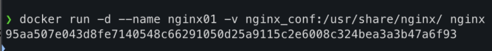
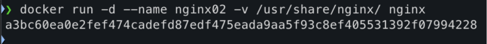

用docker启动kali
docker exec -it  kali bash
# Docker命令
### Linux命令
改主机名：hostnamectl set-hostname xxx
查看当前用户：pwd
创建文件夹：mkdir test
rm -r test
创建文件：touch file1 
rm file1 
### 基础命令
docker镜像的分层结构特点是：所有层均为只读
docker rmi -f  $(docker images -aq) 删除所有镜像
docker rm -f $(docker ps -aq)删除所有容器
容器是镜像运行的实例
镜像看作类，容器是实例化的镜像
容器内无前台进程运行会导致容器自动退出
docker history 查看指定镜像的创建历史
docker tag 升级镜像版本命令
docker inspect nginx    查看nginx镜像的详细信息
后台运行 -d
docker save : 将指定镜像保存成 tar 归档文件
docker load : 导入使用 docker save 命令导出的镜像

创建容器 docker run -dit --name=test_machine ubuntu:18.04 (默认up状态)
进入容器 docker exec -it test_machine /bin/bash
### vim命令
dd删除一行，u （ctrl+z）撤销

## Dockerfile
```
FROM ubuntu:18.04
MAINTAINER xxxx_xxx    
ENV MYPATH /usr/local
WORKDIR $MYPATH
RUN apt update
RUN apt -y install vim
RUN apt -y install net-tools
RUN echo "xxxx_xxx" > file.txt
CMD /bin/bash

FROM # 基础镜像，当前新镜像是基于哪个镜像的
MAINTAINER # 镜像维护者的姓名和邮箱地址
RUN # 容器构建时需要运行的命令
EXPOSE # 当前容器对外保留出的端口
WORKDIR # 指定在创建容器后，终端默认登录的进来工作目录
ENV # 用来在构建镜像过程中设置环境变量
ADD # 将宿主机目录下的文件拷贝进镜像且ADD命令会自动处理URL和解压tar压缩包
COPY # 类似ADD，拷贝文件和目录到镜像中
CMD # 指定一个容器启动时要运行的命令，dockerFile中可以有多个CMD指令，但只有最后一个生效！
ENTRYPOINT # 指定一个容器启动时要运行的命令,形成新的命令组合
```


## 阿里云Docker仓库。
```
docker login --username=aliyun9961787532 crpi-mi3d4ixpugeyb3y3.cn-hangzhou.personal.cr.aliyuncs.com
```
##  从Registry中拉取镜像

```
$ docker pull crpi-mi3d4ixpugeyb3y3.cn-hangzhou.personal.cr.aliyuncs.com/clubsspades_docker/mytomcat:[镜像版本号]
```

## 将镜像推送到阿里云Registry

```
$ docker login --username=aliyun9961787532 crpi-mi3d4ixpugeyb3y3.cn-hangzhou.personal.cr.aliyuncs.com
```

# 本地搭建Docker Register
```
vim /etc/docker/daemon.json 
{
         "insecure-registries":["192.168.171.129:5000"]
}
配置完重启docker
systemctl daemon-reload
systemctl restart docker

创建运行registry镜像
docker run -d -p 5000:5000 --restart=always --name registry -v /opt/myregistry:/var/lib/registry  registry

修改镜像标签+推送镜像
docker tag nginx localhost:5001/nginx:1.0
docker push localhost:5001/nginx:1.0

查看本地仓库已经推送的镜像  
ls -l /opt/myregistry/docker/registry/v2/repositories/

拉取镜像
docker pull localhost:5001/nginx:1.0

查看本地仓库镜像资源：curl 192.168.171.129:5000/v2/_catalog
从私有仓库拉取镜像：docker pull 192.168.171.129:5000/nginx
```

# 持久化存储与数据共享
1、 创建文件夹/home/share，将index.html文件放到文件夹/home/share。
后台方式运行nginx镜像，将本地目录/home/share映射到容器目录/usr/share/nginx/html，
`docker run -d --name nginx -p 8081:80 -v ~/class/docker_class_x x x x/share:/usr/share/nginx/html nginx`
测试能否在容器里面的/usr/share/nginx/html目录找到index.html。

2、 运行两个官方最新nginx镜像，一个实现具名挂载，数据卷名字为nginx_conf，容器内路径为/usr/share/nginx/；一个匿名挂载，容器内路径为/usr/share/nginx/
**具名挂载：**
 
**匿名挂载：**

3、**后台方式运行官方最新的mysql镜像，容器名字mysql-server，端口映射33306:3306，在宿主机上创建数据卷，将目录/home/data挂载到容器目录/var/lib/mysql，密码设置用-e MYSQL_ROOT_PASSWORD=123456** 
`docker run -d --name mysql-server -p 33306:3306 -v ~/class/docker_class_xxxx/data:/var/lib/mysql -e MYSQL_ROOT_PASSWORD=123456 mysql`
启动后进入到容器里面运行命令mysql -u root -p**，输入密码后登录


#### 不进入容器也可以查看ip
例如tomcat容器，`docker inspect registry`
容器和容器之间可以通信

#### docker虚拟网络
--link原理 /etc/hosts文件添加ip和主机名对应

##### 自定义网络
`docker network create --driver bridge --subnet 192.16.0.0/24 --gateway 192.16.0.1 webnet`
通过`docker network ls`查看
新的网络webnet就是自己定义的

启动两个容器测试，使用自己创建的自定义网络的 webnet
`docker run -d -P --name tomcat-net-01 --net webnet tomcat`
`docker run -it --name=centos-net-02 --net webnet centos ping -c 3 tomcat-net-01`


# 期中测试
### Docker基础命令综合应用

1. **分别拉取ubuntu的18.04版本的镜像、mysql最新镜像、nginx最新镜像。**
docker pull ubuntu:18.04
docker pull mysql
docker pull nginx
2. **查看ubuntu的18.04镜像的详细信息，并删除该镜像**
docker inspect ubuntu:18.04
docker rmi ubuntu:18.04
3. **后台方式运行官方最新的mysql镜像，容器名字mysql-server，端口映射33306:3306，在宿主机上创建数据卷，将目录/home/data挂载到容器目录/var/lib/mysql，密码设置为123456 .** 
*宿主机目录：容器目录*
docker run -d --name mysql-server -p 33306:3306 -v /home/data:/var/lib/mysql -e MYSQL_ROOT_PASSWORD=123456 mysql
4. **后台方式运行两个官方最新nginx镜像，一个实现具名挂载，数据卷名字为nginx_volume，容器内路径为/usr/nginx/；一个匿名挂载，容器内路径为/usr/nginx/，端口映射和容器名字自定**
具名挂载：docker run -d --name nginx01 -p 8080:80 -v nginx_volume:/usr/share/nginx/html nginx 
匿名挂载:  docker run -d --name nginx02 -p 8081:80 -v /usr/share/nginx/html nginx
5. **查看数据卷nginx_ volume的详细信息**
docker volume inspect nginx_volume
6. **删除系统中所有容器**
docker rm -f $(docker ps -aq)
### 使用Dockerfile定制tomcat镜像

**材料：apache-tomcat-8.5.59.tar、jdk-8u301-linux-x64.tar**

**要求：在centos镜像上定制tomcat镜像，访问默认网页**

1. **编写Dockerfile文件，构建镜像版本为tomcat:1.0的镜像**

**（要给出构建过程以及Dockerfile文件内容）**

**要求：**

1. **以centos为基础镜像；**

2. **作者要改为自己的姓名拼音和邮箱**

3. **创建数据卷挂载到容器的** **/home/share目录**

4. **定制tomcat镜像必要的代码**
```
FROM registry.cn-hangzhou.aliyuncs.com/xujc/centos
MAINTAINER xxx_xxxx@aaa.com
WORKDIR /usr/local 

ADD jdk-8u301-linux-x64.tar.gz /usr/local/java/
ADD apache-tomcat-8.5.59.tar.gz /usr/local/tomcat/

ENV JAVA_HOME /usr/local/jdk1.8.0_301
ENV CATALINA_HOME /usr/local/apache-tomcat-8.5.59
ENV PATH $PATH:$JAVA_HOME/bin:$CATALINA_HOME/bin

EXPOSE 8080

VOLUME ["/home/share"]

CMD ["/usr/local/apache-tomcat-8.5.59/bin/catalina.sh", "run"]

```
docker build -t tomcat:1.0 .
**2.** **后台方式运行镜像，生成容器名为tomcat-web的容器并用浏览器访问默认网页**
docker run -d --name tomcat_web -p 23048:8080 tomcat:1.0
**3.** **列出镜像的变更历史**
docker history tomcat:1.0
**4.** **进入tomcat01容器然后退出容器**
docker exec -it  tomcat_web /bin/bash
exit
**5.** **停止tomcat01容器**
docker stop tomcat01
**6.  删除tomcat01容器**
docker rm tomcat01
### 部署和创建本地registry服务

**1、使用官方镜像registry创建本地registry服务。运行官方镜像registry，配置适当的参数和选项，实现不用进入容器也能查看仓库的镜像，能自启动**
docker pull registry
docker run -d --name my_registry -p 5001:5000 --retstart=always -v register:/var/lib/registry registry
`curl 192.168.31.115:5001/v2/_catalog`
**2、将第二题定制的tomcat:1.0镜像推送到本地registry 服务的私有仓库。**
docker tag tomcat:1.0 localhost:5001/tomcat:1.0
docker push localhost:5001/tomcat:1.0
**3、查看本地仓库镜像资源**
`curl 192.168.31.115:5001/v2/_catalog`
### 创建自定义网络

**1、创建一个自定义网络net-web，子网为192.16.0.0/24，网关为：192.16.0.1。**
docker network create --driver bridge --subnet 192.16.0.0/24 --gateway 192.16.0.1 net-web 
**2、后台方式运行tomcat最新镜像，容器名字为tomcat-net,** **要使用自己创建的自定义网络的 net-web，端口映射为9090:8080**
docker run -d --name tomcat-net -P --net net-web -p 9090:8080 tomcat
**3、运行centos最新镜像，使用自定义网络 net-web,容器名字为centos-web，进入到容器里面，用ping命令ping容器名tomcat-net，测试是否连通。**
docker run -dit --name centos-web --net net-web centos
docker exec -it centos-web bash
ping tomcat-net

